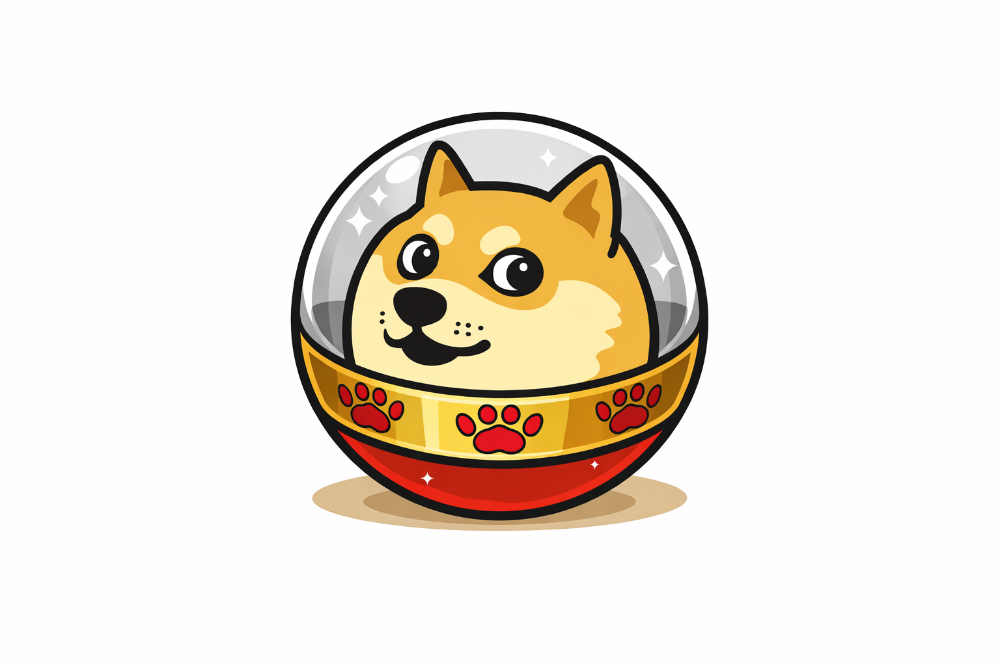

  

# dogeball

dogeball is a powerball-style token distribution mechanism inspired by the doge meme and built using Molt Bot–generated code and execution logic.

The system converts ongoing protocol activity into periodic randomized reward rounds that automatically distribute tokens to holders — without staking, snapshots, or claim transactions.

This repository serves as a full reference implementation designed for transparency, inspection, and extension.

---

## Core Idea

dogeball runs as a continuous loop:

1. Protocol activity generates fees  
2. Fees are routed into a distribution pool  
3. At fixed intervals, a distribution round is triggered  
4. Random holders are selected using deterministic entropy  
5. Rewards are paid out directly on-chain  

Each round behaves like a powerball draw.

Most rounds distribute smaller rewards across multiple holders.  
Some rounds concentrate larger payouts to fewer wallets.

---

## Design Goals

- No staking  
- No snapshots  
- No claim transactions  
- Fully deterministic and replayable  
- Transparent distribution logic  
- Simple holder eligibility rules  
- Resistant to manipulation  

---

## Architecture

dogeball is composed of four primary contracts:

### dogeball.sol
ERC20-compatible token with fee routing hooks.

### TreasuryRouter.sol
Routes collected fees into the active distribution pool.

### DistributionEngine.sol
Executes timed distribution rounds and selects winning addresses.

### EntropyOracle.sol
Provides deterministic entropy derived from chain state.

---

## Distribution Rounds

A distribution round is triggered at a fixed interval.

Each round:
- Locks the current pool balance  
- Computes entropy using recent block data  
- Selects N winning holders  
- Computes weighted payouts  
- Executes transfers atomically  

No user interaction is required.

---

## Entropy Model

Entropy is derived from:
- Previous block hash  
- Total token supply  
- Current round index  
- Pool balance  

This ensures:
- Determinism  
- Replayability  
- Resistance to miner manipulation  

---

## Holder Eligibility

A wallet is eligible if:
- Balance is above the minimum threshold  
- Tokens were acquired before the round lock  
- Wallet is not blacklisted or excluded  

---

## Simulation

The `scripts/` directory contains simulation tools for validating distribution fairness and payout variance across multiple rounds.

---

## Security Notes

This system has **not** been audited.

Do not deploy without:
- Independent security review  
- Parameter tuning  
- Stress testing  

---

## Philosophy

dogeball treats distribution as an event, not yield.

Holders do not opt in.  
They simply exist.

---

## License

MIT
